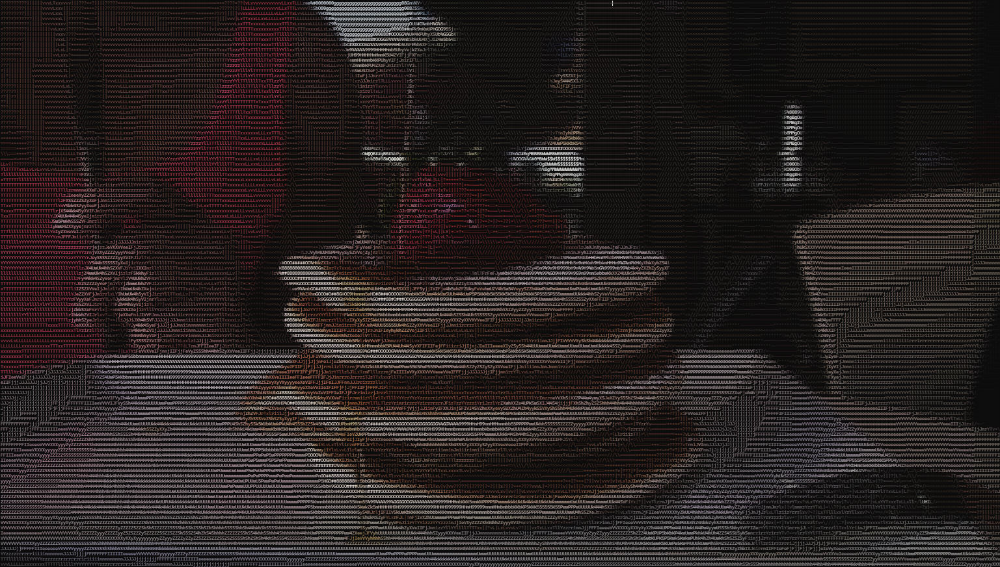

# pnk-pkv

An ASCII art video player in your terminal.



## ✨ Features

- Decode and play almost any video format, in your terminal
- Cross-platform
- More coming soon!

## 🚀 Getting started

#### Prerequisites

- [CMake](https://cmake.org/) (3.10+)
- [FFmpeg](https://ffmpeg.org)
- C99 compatible compiler

#### Building

```bash
git clone https://github.com/Hurubon/pnk-pkv
cd pnk-pkv
cmake -S . -B bin
cmake --build bin
```

#### Running

```bash
bin/pkv.exe res/demo.mp4
```

Make sure your terminal is in fullscreen and zoom out/lower font size if necessary.

## 📜 License

Distributed under the **GPLv3** license.\
See [LICENSE](LICENSE) for details.

## 🙏 Acknowledgments

- Demo video by [Matthias Groeneveld on Pixabay](pixabay.com/videos/pancakes-honey-strawberry-food-12424/)
- Inspired/influenced by [doom-ascii on GitHub](https://github.com/wojciech-graj/doom-ascii)
- Inspired/influenced by [ThePrimeagen on YouTube](https://www.youtube.com/watch?v=3f9tbqSIm-E)
- Influenced by [Acerola on YouTube](https://www.youtube.com/watch?v=gg40RWiaHRY)
- Influenced by [Useless Game Dev on YouTube](https://www.youtube.com/watch?v=oIKMCwj9lK8)
- An amazing explanation of ANSI color escape sequences by [Richard on StackOverflow](https://stackoverflow.com/a/33206814)
- The [Together C & C++](https://discord.gg/tccpp) community on Discord.

## ✏️ Notes

`pkv` is still in active development. Contributions and suggestions are welcome and wanted!

This README has been optimized for accessibility based on GitHub's blogpost "[Tips for Making your GitHub Profile Page Accessible](https://github.blog/2023-10-26-5-tips-for-making-your-github-profile-page-accessible)".
